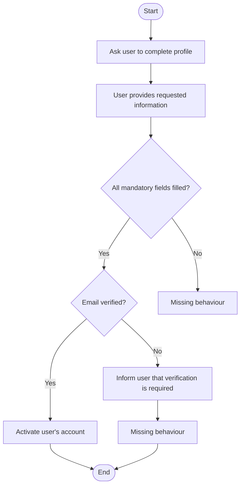

# AAMC – AI-Assisted Model Creation

AAMC (AI‑Assisted Model Creation) is an AI‑supported capability within the TestCompass eMBT workflow.
It generates a first, semantically consistent model draft from plain‑language inputs such as requirements, user stories, or scenarios.
AAMC accelerates early modelling while keeping the tester fully in control.

AAMC follows strict eMBT principles:  
it models only explicitly described behaviour, does not invent missing steps, does not populate implicit branches, does not generate Result Nodes unless a result is explicitly stated, and ends a model only when the requirement describes a natural conclusion. Underspecified behaviour remains intentionally incomplete.
Because AAMC is AI‑driven, the exact visual form of the model may vary (for example, whether an End Node is included).
This does not affect semantics: AAMC never models behaviour that is not explicitly described.

TestCompass automatically validates the generated model and highlights issues directly in the diagram.
Missing paths, ambiguous behaviour, invalid node semantics, and structural inconsistencies are marked with clear red exclamation marks, making uncertainty visible early — a core principle of eMBT.

---

## Purpose

AAMC is designed to support early Model Based Testing (eMBT) by helping teams:

- make behaviour explicit early
- avoid assumptions
- uncover risks sooner
- build shared understanding before development begins
- create a structured starting point for deeper modelling and test design

AAMC accelerates the start of the modelling process by generating a high‑quality first draft.
This allows testers to begin working in TestCompass sooner and focus their time on what matters most:
critical thinking, refinement and deeper exploration of system behaviour.

AAMC does not replace modelling expertise.
It provides an initial model that the tester reviews, corrects, and evolves into a mature Test Model.

---

## How AAMC Works

AAMC can process a wide range of inputs.
It accepts natural‑language descriptions such as:

- requirements
- user stories
- acceptance criteria
- scenarios
- domain descriptions

AAMC can also interpret structured inputs, including:

- BPMN 2.0 XML
- JSON representations of workflows or state transitions
- Mermaid diagrams
- Gherkin scenarios
- Other machine‑readable formats that describe behaviour

From these inputs, AAMC produces:

- an initial model structure
- nodes and transitions with consistent semantics
- a clear behavioural flow
- a model that is immediately testable in TestCompass

The output is always:

- explicit
- traceable
- reproducible
- aligned with eMBT principles 

---

## Example: Generating an eMBT Model from Natural Language Requirements

AAMC converts natural language requirements into a structured, semantically consistent eMBT model.  
The example below demonstrates how AAMC interprets a short requirement, identifies decisions, and exposes incomplete behaviour without making assumptions.

---

### Input Requirement (English)

After creating an account, the system asks the user to complete their profile.
The user provides the requested information.
The system checks whether all mandatory fields are filled in.
If all mandatory fields are provided, the system verifies the user’s email address.
If the email is verified, the system activates the user’s account.
If the email is not verified, the system informs the user that verification is required.
(The requirement does not describe what happens if mandatory fields are missing.)
(The requirement does not describe what happens after informing the user about email verification.)

---

### Generated Model (Mermaid)
AAMC generates a full TestCompass model.
The Mermaid diagram shown below is only a documentation-friendly visualization of that model, not the model itself.

## Explanation
- AAMC performs the following:
- Identifies decisions (“All mandatory fields filled?”, “Email verified?”)
- Creates a clean, readable model without adding behaviour that is not explicitly described
- Leaves incomplete paths open, marking them as missing behaviour
- Ensures semantic correctness according to eMBT rules

This example illustrates how AAMC exposes ambiguity in requirements instead of hiding it, enabling teams to clarify missing behaviour early in the process.

---

## What AAMC Is *Not*

AAMC is **not**:

- a flowchart generator  
- a diagram beautifier  
- a replacement for modelling expertise  
- a tool that “guesses” behaviour  

It is an **engineering-grade modelling assistant** that supports critical thinking and early discovery.

---

## Example Workflow

1. Provide AAMC with a requirement, user story, or structured input
2. AAMC generates a first model draft
3. The tester reviews the structure and requests adjustments from the AI if needed
4. The tester iterates with AAMC until the draft reflects the intended behaviour
5. Once accepted, the model becomes editable in TestCompass for manual refinement
6. The refined model forms the basis for test generation and impact analysis

This workflow supports early exploration, accelerates the modelling process and reduces the time needed to reach a stable, explicit model.

---

## Benefits

AAMC helps teams:

- start modelling earlier  
- reduce ambiguity
- identify missing behaviour
- challenge assumptions
- accelerate the path to testable models
- improve collaboration between testers, analysts, and developers
- lower the barrier to modelling
- provide a high‑quality first draft
- enable iterative refinement with AI
- increase modelling consistency
- support multiple input formats
- make behaviour explicit early
- strengthen early risk discovery
- improve traceability  

---

## Relation to eMBT

AAMC is fully aligned with the eMBT philosophy:

- **explicit models**  
- **no hidden logic**  
- **no assumptions**  
- **traceable test generation**  
- **early risk discovery**  

AAMC strengthens the early phase of modelling by providing a structured starting point that supports deeper reasoning.

---

## Roadmap

Future enhancements may include:

- additional model refinement suggestions  
- domain‑specific modelling patterns  
- improved semantic validation  
- deeper integration with AAMR  

---

## History
AAMC was first publicly documented in this repository in May 2026.

---

## Contact

For more information about AAMC or the TestCompass eMBT workflow, please visit the website or reach out via LinkedIn.
